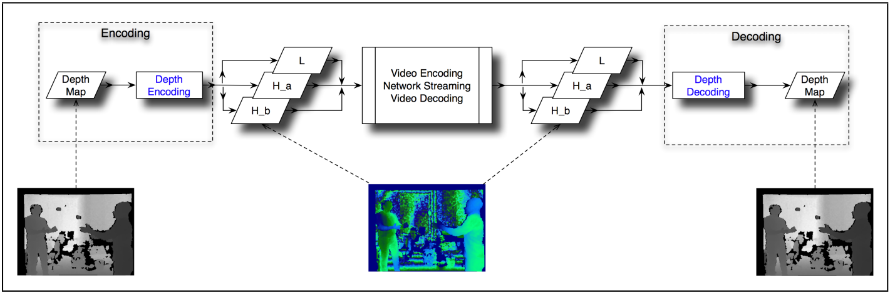
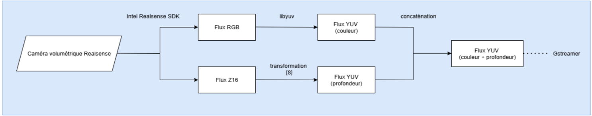

# RGBD Streaming

This part of the project handles the networking of the RGBD stream.

**Note:** A compiled version (Release) is available in the Releases section on the project's GitHub interface.

## Dependencies

These codes require the following libraries:

- **libyuv** – automatically installed during compilation with this CMake file ([libyuv Documentation](https://chromium.googlesource.com/libyuv/libyuv/))
- **Intel RealSense SDK 2.0** – to capture the RGBD stream from the camera ([Intel RealSense SDK](https://github.com/IntelRealSense/librealsense))
- **GStreamer** – to perform video compression and RTP networking ([GStreamer Documentation](https://gstreamer.freedesktop.org/documentation/))
- **OpenCV** – for image processing
- **CMake** (version 3.12 minimum) – for compilation
- **pkg-config** – for dependency management

## Installing Dependencies (Windows)

### GStreamer
1. Download the GStreamer installers from the [official website](https://gstreamer.freedesktop.org/download/)
2. Install both packages:
   - **gstreamer-1.0-msvc-x86_64-X.XX.X.msi** (runtime)
   - **gstreamer-1.0-devel-msvc-x86_64-X.XX.X.msi** (development)
3. Add the installation paths to the system environment variables

### Intel RealSense SDK 2.0
1. Download the installer from [Intel RealSense Releases](https://github.com/IntelRealSense/librealsense/releases)
2. Install the SDK in the default directory: `C:\Program Files (x86)\Intel RealSense SDK 2.0`
3. The CMakeLists.txt is configured for this default path

### OpenCV
1. Download OpenCV from the [official website](https://opencv.org/releases/)
2. Install and configure the `OpenCV_DIR` environment variable

## Compilation

### Configuration and Compilation

1. Clone the project and navigate to the directory:
```bash
cd RGBD_streaming
```

2. Create a build directory:
```bash
mkdir build
cd build
```

3. Generate the compilation files with CMake:
```bash
cmake ..
```

4. Compile the project:
```bash
cmake --build . --config Release
```

### Generated Executables

After compilation, the following executables will be available in the `build` directory:

- **send** – Captures and sends the RGBD stream over the network
- **receive** – Receives and decodes the RGBD stream
- **Tests_z16_yuv** – Z16 to YUV conversion tests
- **rs_tests** – RealSense SDK tests
- **quality_over_network_capture** – Quality tests with capture
- **quality_over_network_openbag** – Quality tests from bag files
- **quality_over_network_save_to_raw** – Raw data saving
- **local_compression** – Local compression tests

### Important Notes

- **libyuv** will be automatically downloaded and compiled during the first compilation if not found locally
- On Windows, the `realsense2.dll` DLL will be automatically copied to the `rs_tests` executable directory
- The project uses the C++20 standard

## Project Structure

### Experimental Code

- `send.cpp`, `send.h`
- `encode_z16.cpp`, `encode_z16.h` – Includes functions for Z16 → YUV transformation based on [1] and uses lookup tables to accelerate processing
- `encodeRGBtoI420.cpp`, `encodeRGBtoI420.h` – Functions using the libyuv library to convert frames from RGB format to I420 format to prepare for video compression, and functions to concatenate or deconcatenate frames

### Quality Testing Code

- `rs_test.cpp`, `rs_test.h`
- `quality_over_network...`
- `local_compression.cpp`

## General Operation of send

Heavily inspired by [this GStreamer C++ tutorial](https://www.it-jim.com/blog/gstreamer-cpp-tutorial/) for using GStreamer.

Frames are captured from the camera using the Intel RealSense SDK. There are 2 types of frames:

- **Color frames** in RGB format (sometimes using ARGB)
- **Depth frames** (depth map) in Z16 format (encoding depth on 16 bits per pixel)

RGB frames are transformed to YUV, Z16 depth frames are transformed to YUV, then the transformed frames are concatenated vertically (to ensure their synchronization upon reception). GStreamer is used to encode the frames in H.264 and send them over the network via RTP.

  


### Video Encoding Configuration

This line of code allows you to choose the H.264 video encoding parameters:

```cpp
gchar* pipeStr = g_strdup_printf(
    "appsrc is-live=true name=mysrc format=time "
    "caps=video/x-raw,format=I420 ! "
    "queue max-size-buffers=1 leaky=downstream ! "
    "videoconvert ! "
    "nvh264enc repeat-sequence-header=true preset=low-latency tune=ultra-low-latency zerolatency=true "
    "rc-mode=cbr bitrate=20000 gop-size=5 bframes=0 cabac=false "
    "qp-min-i=20 qp-max-i=30 qp-min-p=20 qp-max-p=30 !"
    " video/x-h264,profile=baseline ! "
    "rtph264pay config-interval=1 pt=96 mtu=1200 ! "
    "queue max-size-buffers=1 leaky=downstream ! "
    "udpsink host=%s port=5000 sync=false async=false",
    host
);
```

The parameters have been chosen to minimize latency.

## References

[1] Pece, F., Kautz, J., & Weyrich, T. (2011). "Adapting Standard Video Codecs for Depth Streaming". [https://jankautz.com/publications/depth-streaming.pdf](https://jankautz.com/publications/depth-streaming.pdf)